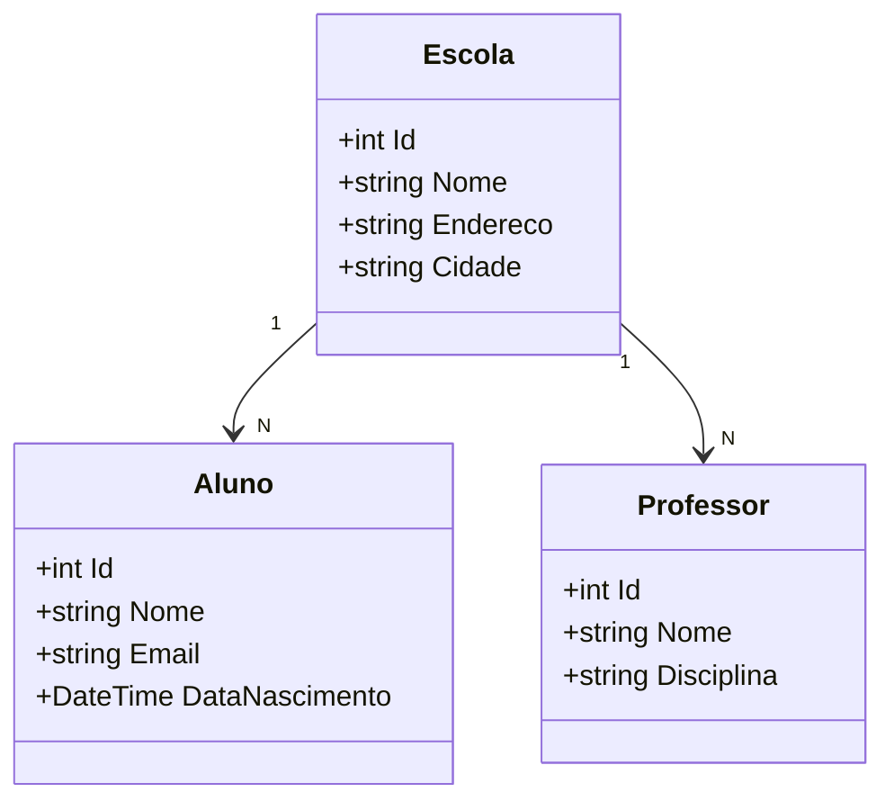


# 🎓 API Escola Piaget - DevOps & Cloud Computing
**Projeto Final - Curso de DevOps**

---

## 📋 Sobre o Projeto
API REST desenvolvida em **.NET 8** para gerenciamento escolar, contendo as entidades **Escola**, **Aluno** e **Professor**. 
O projeto foi construído com foco em **boas práticas DevOps**, containerização e preparação para nuvem, aplicando os conceitos aprendidos durante o curso.

---

## 🎯 Objetivos do Projeto
- Aplicar os conceitos de **Cultura DevOps** (colaboração, automação e CI/CD)
- Praticar **Containerização** com Docker
- Implementar **Infraestrutura como Código (IaC)**
- Utilizar boas práticas de desenvolvimento (DTOs, Validação, AutoMapper)
- Preparar a aplicação para deploy em nuvem

---

## 🛠️ Tecnologias Utilizadas
| Tecnologia                        | Versão      | Finalidade |
|----------------------------------|-------------|----------|
| .NET                             | 8.0         | Framework |
| ASP.NET Core Web API             | 8.0         | API REST |
| Entity Framework Core            | 8.0         | ORM |
| SQL Server                       | 2022        | Banco de Dados |
| AutoMapper                       | -           | Mapeamento |
| FluentValidation                 | -           | Validação |
| Swagger / OpenAPI                | -           | Documentação |
| Docker + Docker Compose          | -           | Containerização |
| Health Checks                    | -           | Monitoramento |

---

## 🏗️ Estrutura do Projeto
```
ApiDockerPiaget/
├── Controllers/          → Escolas, Alunos e Professores
├── Data/                 → AppDbContext
├── DTOs/                 → Objetos de transferência
├── Models/               → Entidades
├── Mappings/             → AutoMapper Profile
├── Validators/           → FluentValidation
├── HealthChecks/         → Health Checks personalizados
├── Middleware/           → Global Exception Handler
├── Dockerfile
├── docker-compose.yml
└── appsettings.Development.json
```

---


## 🚀 Como Executar o Projeto
### Opção 1: Com Docker (Recomendado)

```bash
# 1. Na raiz do projeto
docker-compose down --rmi all

# 2. Build e executar
docker-compose up --build
```


A API estará disponível em: **http://localhost:8080**

Swagger: **http://localhost:8080/swagger**

Health Check: **http://localhost:8080/health**

### Opção 2: Local (sem Docker)

```bash
dotnet restore
dotnet run
```


## ? Funcionalidades

- CRUD completo para Escolas, Alunos e Professores
- Relacionamentos um-para-muitos (Escola ? Alunos/Professores)
- Validação avançada com FluentValidation
- Mapeamento automático com AutoMapper
- Tratamento global de exceções
- Health Checks personalizados
- Documentação interativa com Swagger
- Totalmente containerizado com Docker


## ??? Arquitetura do Projeto
### Estrutura de Pastas

ApiDockerPiaget/
??? Controllers/
??? Data/
??? DTOs/
??? Models/
??? Mappings/
??? Validators/
??? HealthChecks/
??? Middleware/
??? Properties/
??? appsettings.json
??? Dockerfile
??? docker-compose.yml
??? Program.cs


### Diagrama UML (Contextual)
classDiagram
    class Escola {
        +int Id
        +string Nome
        +string Endereco
        +string Cidade
        +string Telefone
    }
    class Aluno {
        +int Id
        +string Nome
        +string Email
        +DateTime DataNascimento
        +string Serie
        +int EscolaId
    }
    class Professor {
        +int Id
        +string Nome
        +string Email
        +string Disciplina
        +string Titulacao
        +int EscolaId
    }

    Escola "1" --> "N" Aluno
    Escola "1" --> "N" Professor


## ?? Como Executar o Projeto

### 1. Local (sem Docker)
dotnet restore
dotnet build
dotnet run


Acesse: `http://localhost:5254/swagger`

### 2. Com Docker (Recomendado - Aula 11)
docker-compose up --build


A API estará disponível em: `http://localhost:8080`
Health Checks:
- `http://localhost:8080/health`
- `http://localhost:8080/health/ready`


---

## 📡 Principais Endpoints

| Método | Endpoint                    | Descrição |
|--------|-----------------------------|---------|
| GET    | `/api/Escolas`              | Listar escolas |
| GET    | `/api/Alunos`               | Listar alunos |
| GET    | `/api/Professores`          | Listar professores |
| POST   | `/api/Alunos`               | Cadastrar aluno |
| PUT    | `/api/Escolas/{id}`         | Atualizar escola |

---

## 🛡️ Boas Práticas Implementadas

- Uso de **DTOs** para segurança
- Validação com **FluentValidation**
- Mapeamento automático com **AutoMapper**
- Tratamento global de exceções
- Health Checks
- CORS configurado
- Separação clara de responsabilidades

---

## 🐳 Docker & DevOps

- **Dockerfile** multi-stage (otimizado)
- **docker-compose** com API + Banco de dados
- Infraestrutura como Código (IaC)
- Preparado para CI/CD e Kubernetes

---

## 📊 Diagrama de Relacionamentos




## ?? Próximos Passos (Melhorias Futuras)

- Implementação de Kubernetes (Aula 12)
- Pipeline completo de CI/CD (Aula 13)
- Deploy na nuvem (Azure App Service ou AWS ECS)
- Autenticação e Autorização (JWT)
- Logging centralizado (Serilog + Seq)
- Testes unitários e de integração


# INSERTs Completo (SQL Server)
-- =============================================
-- INSERIR ESCOLAS primeiro
-- =============================================

INSERT INTO Escolas (Nome, Endereco, Cidade, Telefone) VALUES 
('Escola Piaget', 'Rua das Flores, 123', 'São Paulo', '(11) 98765-4321'),
('Colégio Einstein', 'Av. Paulista, 1500', 'São Paulo', '(11) 3456-7890'),
('Instituto Montessori', 'Rua das Acácias, 450', 'Campinas', '(19) 98765-1234');

-- =============================================
-- INSERIR ALUNOS
-- =============================================

INSERT INTO Alunos (Nome, Email, DataNascimento, Serie, EscolaId) VALUES 
('João Silva', 'joao.silva@email.com', '2015-05-12', '6º Ano', 1),
('Maria Oliveira', 'maria.oliveira@email.com', '2014-08-25', '7º Ano', 1),
('Pedro Santos', 'pedro.santos@email.com', '2016-01-10', '5º Ano', 1),
('Ana Clara Mendes', 'ana.mendes@email.com', '2013-11-30', '8º Ano', 2),
('Lucas Ferreira', 'lucas.ferreira@email.com', '2015-03-18', '6º Ano', 2);

-- =============================================
-- INSERIR PROFESSORES
-- =============================================

INSERT INTO Professores (Nome, Email, Disciplina, Titulacao, EscolaId) VALUES 
('Prof. Carlos Almeida', 'carlos.almeida@escola.com', 'Matemática', 'Mestre', 1),
('Profª Juliana Costa', 'juliana.costa@escola.com', 'Português', 'Doutora', 1),
('Prof. Roberto Mendes', 'roberto.mendes@escola.com', 'História', 'Especialista', 1),
('Profª Fernanda Lima', 'fernanda.lima@escola.com', 'Ciências', 'Mestre', 2),
('Prof. Marcos Silva', 'marcos.silva@escola.com', 'Inglês', 'Especialista', 2);


# Verificar os dados inseridos:

-- Ver tudo
SELECT * FROM Escolas;
SELECT * FROM Alunos;
SELECT * FROM Professores;

-- Ver com relacionamentos
SELECT 
    e.Nome AS Escola,
    a.Nome AS Aluno,
    a.Serie
FROM Escolas e
LEFT JOIN Alunos a ON a.EscolaId = e.Id;

SELECT 
    e.Nome AS Escola,
    p.Nome AS Professor,
    p.Disciplina
FROM Escolas e
LEFT JOIN Professores p ON p.EscolaId = e.Id;


## 👨‍🏫 Informações do Projeto

- **Prof:** Francisco
- **Disciplina:** DevOps & Cloud Computing
- **Objetivo:** Demonstrar na prática os conceitos de DevOps


## Doker no terminal

docker-compose down --rmi all
docker-compose build --no-cache
docker-compose up


```


